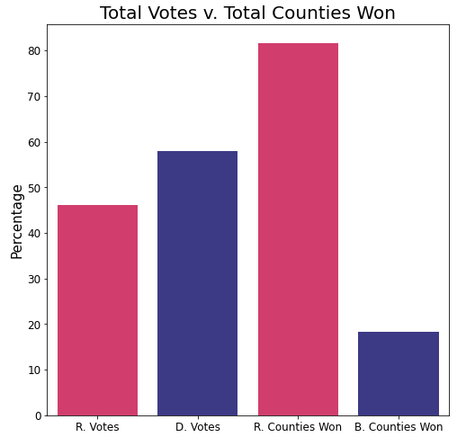

# Election Prediction through Logistic Regression
##### Authors: Will Cline, CeCe Lacey, John Carter Simmons
***
## Goals
* We sought to build an accurate predictor of Presidential election outcomes by county for 5 states: California, Florida, Illinois, Michigan, and Texas.
* We also sought to determine as a proof of concept whether vaccination rates for the county are useful in vote outcomes.

***
## Methods

* We utilized 2015 and 2019 census data along with geographical and vaccination data by county in tandem with their following year’s election results.
* 2016 data was used to predict election results of 2020

***
## Visualizations

***
### Win Margin Distribution

***
### Total Votes

## Best Model Results

## Next Steps
* Midterm election data may be collected and used on our same model.
* Census and vaccine data for prior years may be collected to enhance model with data of elections from 2000 onward.
* In the upcoming 2024 election, predictions can be made using 2016 and 2020 data for an even more accurate prediction.

## Contacts
#### Github:
* Will: https://github.com/willcline613/
* CeCe: https://github.com/cclacey/
* John Carter: https://github.com/john-c-simmons/
#### Linkedin:
* Will: https://www.linkedin.com/in/will-cline-9924a1183/
* CeCe: https://www.linkedin.com/in/cece-lacey-13a389b8/